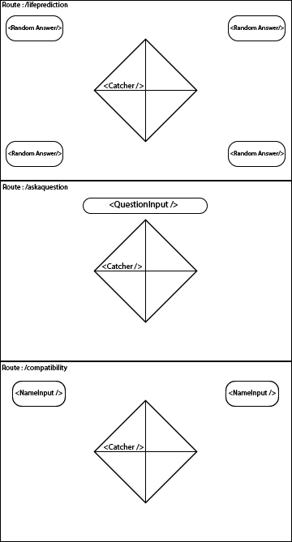

# The Code-y Catcher

#### A web application that mimics a popular 90's paper-crafted fortune teller (the "cootie catcher"), built using react.

-----
## Wireframe:

-----
## Reason for app:

Currently, people are stuck in their homes and looking for something enjoyable to do. Simple but entertaining games have taken a steep incline in popularity across social media as people fight the quarantine funk. This, to me, seems like the perfect time to bring back a version of a game that we all got countless laughs from as children.

-----
## Audience:

 The intended audience for this application consists or Millenials who enjoy a wave of nostalgia, as well as a new audience in today's youth who may not be familiar with the game at all. 
